# Smart E-Commerce Checkout System

A cloud-based microservices architecture demonstrating a complete e-commerce checkout pipeline using REST APIs, asynchronous messaging, and persistent database storage — without a UI.

---

## Table of Contents

- [Overview](#overview)
- [Architecture](#architecture)
- [Technologies Used](#technologies-used)
- [Project Structure](#project-structure)
- [Prerequisites](#prerequisites)
- [Installation & Setup](#installation--setup)
- [Running the Services](#running-the-services)
- [API Documentation](#api-documentation)
- [Discount Function](#discount-function)
- [RabbitMQ Messaging](#rabbitmq-messaging)
- [Database Verification](#database-verification)
- [Expected Outcomes](#expected-outcomes)
- [Shutdown](#shutdown)

---

## Overview

This project demonstrates the **end-to-end execution** of a Smart E-Commerce Checkout System by connecting individual microservices into a complete checkout pipeline that reflects a real-world e-commerce workflow.

The system includes:
- **Cart Service** — manages shopping cart items
- **Payment Service** — processes payments with or without discount
- **Inventory Service** — tracks stock levels in MySQL database
- **Discount Function** — serverless-style discount code handler
- **RabbitMQ** — asynchronous event messaging between services
- **MySQL** — persistent database for inventory

---

## Architecture

```
┌─────────────────────────────────────────────────────┐
│           Smart E-Commerce Checkout Pipeline         │
│                                                      │
│   [Cart Service]  ──▶  [Discount Function]           │
│        │                      │                      │
│        ▼                      ▼                      │
│  [Payment Service]  ──▶  [Inventory Service]         │
│        │                      │                      │
│        ▼                      ▼                      │
│   [RabbitMQ]             [MySQL Database]            │
└─────────────────────────────────────────────────────┘

Flow: Cart → Discount → Payment → Inventory → RabbitMQ Event
```

---

## Technologies Used

| Technology | Purpose | Version |
|-----------|---------|---------|
| Node.js + Express | Cart Service | 18 |
| Python + Flask | Payment Service | 3.11 |
| Spring Boot + JPA | Inventory Service | 3.1.2 |
| MySQL | Inventory Database | 8 |
| RabbitMQ | Async Messaging | 3 |
| Docker + Compose | Containerization | Latest |
| Postman | API Testing | Latest |

---

## Project Structure

```
smart-ecom/
│
├── cart-service/
│   ├── index.js
│   ├── package.json
│   └── Dockerfile
│
├── payment-service/
│   ├── app.py
│   ├── notify.py
│   └── Dockerfile
│
├── inventory-service/
│   ├── src/main/java/com/example/inventory/
│   │   ├── InventoryController.java
│   │   ├── Stock.java
│   │   └── StockRepository.java
│   ├── src/main/resources/
│   │   └── application.properties
│   ├── pom.xml
│   └── Dockerfile
│
├── discount-function/
│   ├── handler.js
│   └── serverless.yml
│
├── deploy/
│   ├── docker-compose.yml
│   ├── k8s-cart.yaml
│   └── nginx.conf
│
└── README.md
```

---

## Prerequisites

- [Docker Desktop](https://www.docker.com/products/docker-desktop/)
- [Node.js v18+](https://nodejs.org/)
- [Python 3.x](https://www.python.org/)
- [Postman](https://www.postman.com/downloads/)

```bash
pip install pika
```

---

## Installation & Setup

```bash
unzip smart-ecom.zip
cd smart-ecom
```

---

## Running the Services

```bash
cd deploy
docker-compose up --build -d
```

### All Containers Running

> Screenshot: All 5 Docker containers running

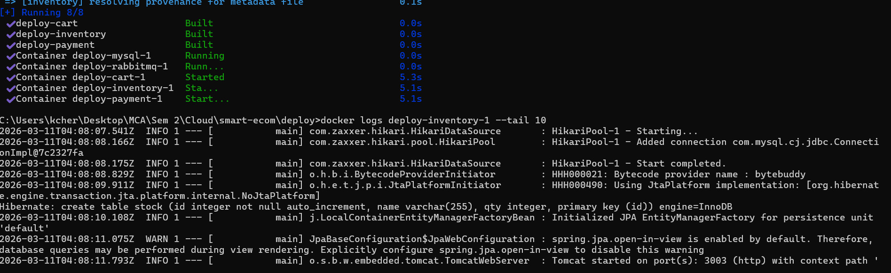

---

## API Documentation

### 1. Inventory Service — Port 3003

#### POST — Add Inventory Items

```
POST http://localhost:3003/inventory/update
Content-Type: application/json
```

```json
{
  "Laptop": 50,
  "Phone": 100,
  "Headphones": 30
}
```

> Screenshot: Inventory items added successfully

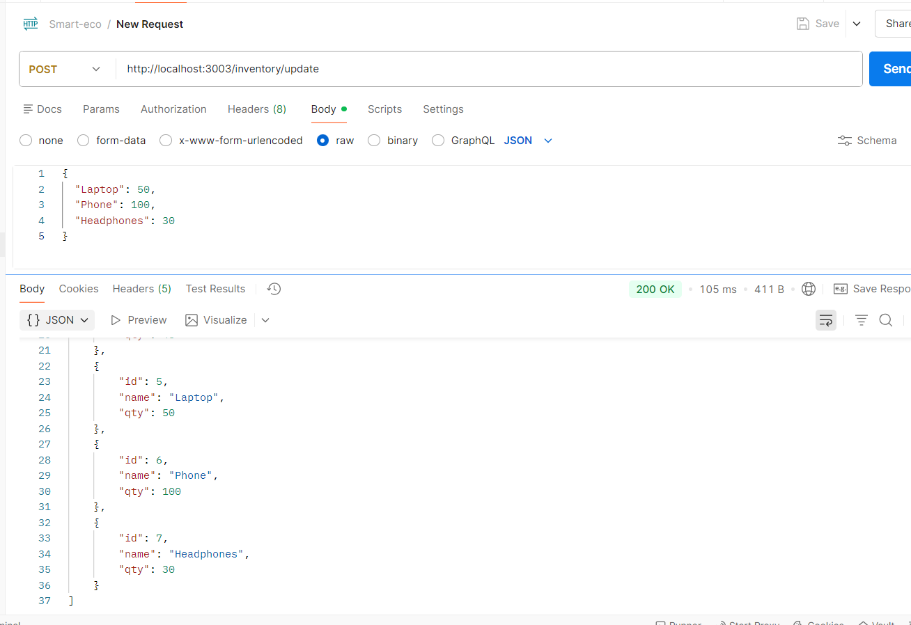

---

#### GET — Retrieve All Inventory Items

```
GET http://localhost:3003/inventory/view
```

> Screenshot: All inventory items retrieved from MySQL

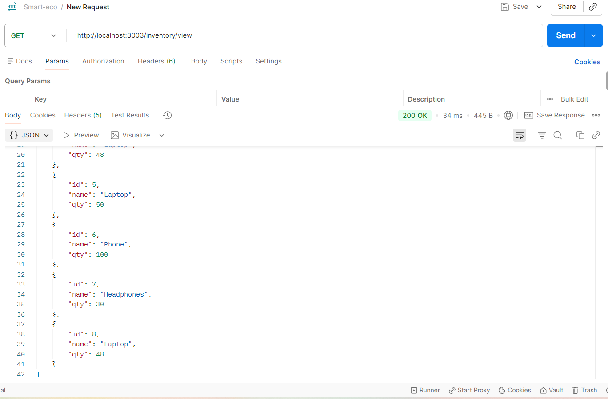

---

#### PUT — Update Inventory After Purchase

```
POST http://localhost:3003/inventory/update
Content-Type: application/json
```

```json
{
  "Laptop": 48
}
```

> Screenshot: Laptop quantity updated to 48 after purchase

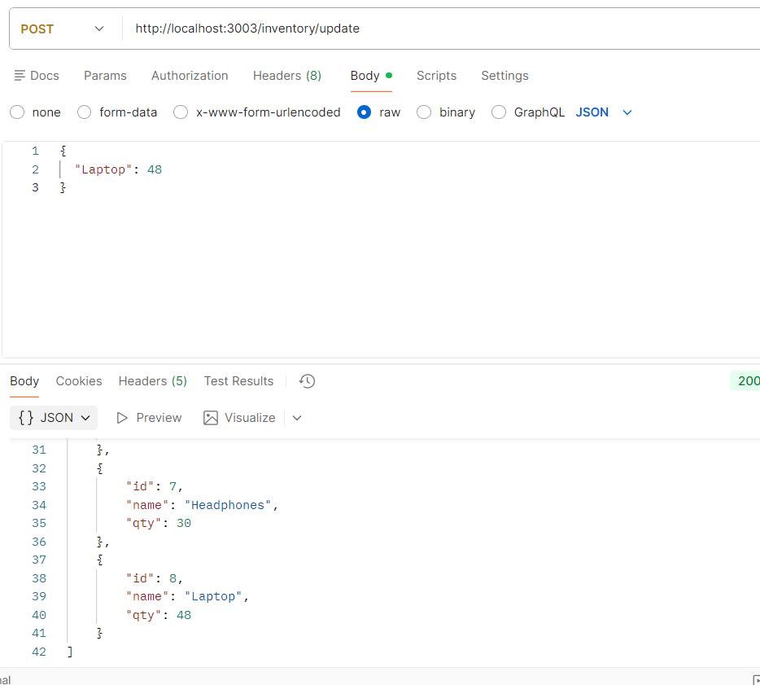

---

### 2. Cart Service — Port 3001

#### POST — Add Item to Cart

```
POST http://localhost:3001/add
Content-Type: application/json
```

```json
{
  "item": {
    "name": "Laptop",
    "price": 999.99,
    "qty": 2
  }
}
```

> Screenshot: Item added to cart successfully

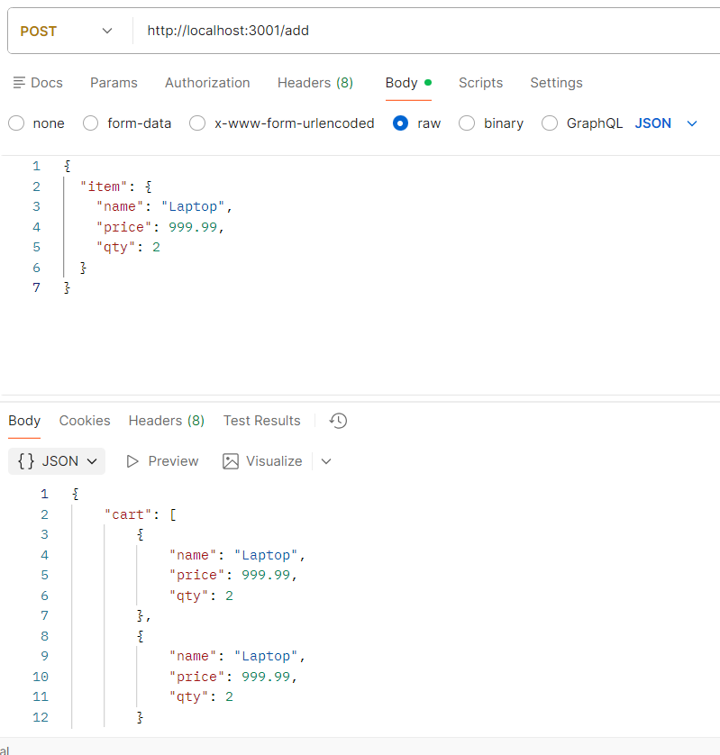

---

#### GET — View Cart Contents

```
GET http://localhost:3001/view
```

> Screenshot: Cart contents displayed

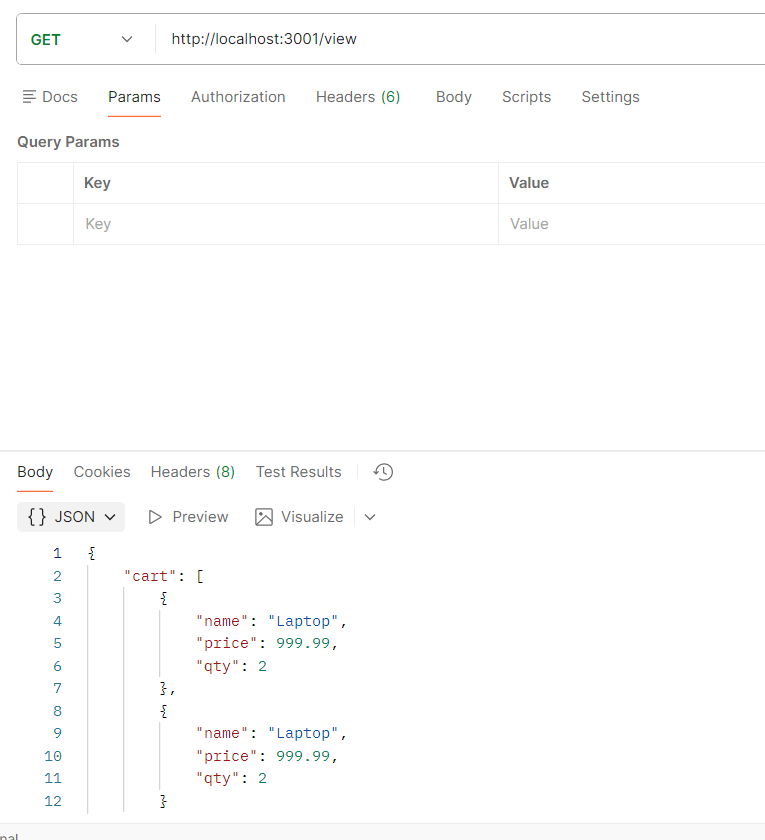

---

### 3. Payment Service — Port 3002

#### POST — Payment WITH Discount (NEWYEAR = 20% off)

```
POST http://localhost:3002/pay
Content-Type: application/json
```

```json
{
  "amount": 799.99,
  "method": "card",
  "discount_code": "NEWYEAR"
}
```

> Screenshot: Payment processed with NEWYEAR discount

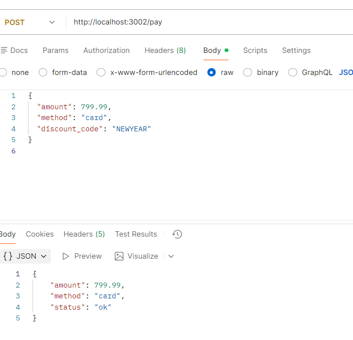

---

#### POST — Payment WITHOUT Discount

```
POST http://localhost:3002/pay
Content-Type: application/json
```

```json
{
  "amount": 999.99,
  "method": "UPI"
}
```

> Screenshot: Payment processed without discount

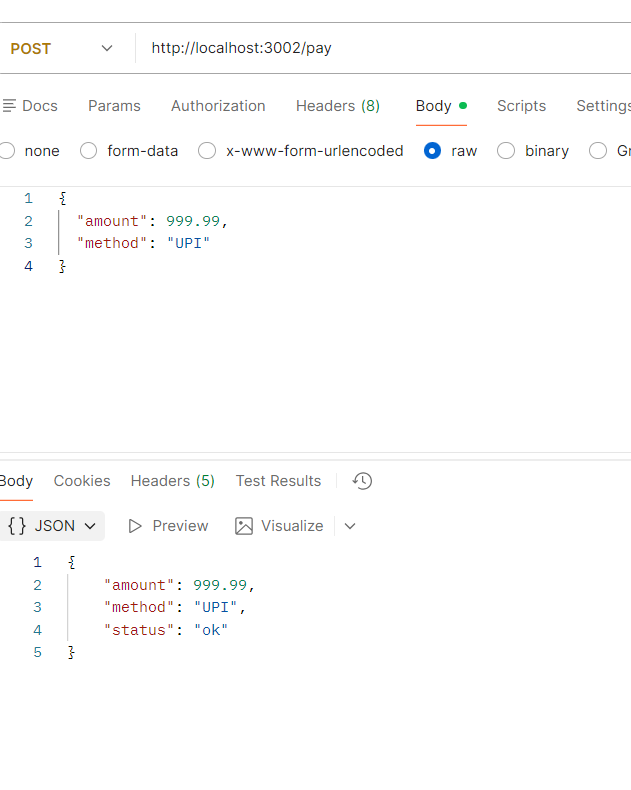

---

## Discount Function

```bash
cd discount-function
node -e "const h=require('./handler');h.apply({body:JSON.stringify({code:'NEWYEAR',amount:999.99})}).then(r=>{const b=JSON.parse(r.body);console.log('Code: NEWYEAR');console.log('Discount: '+b.discount*100+'%');console.log('Original Total: 999.99');console.log('Final Total: '+(999.99-(999.99*b.discount)).toFixed(2));});"
```

Output:
```
Code: NEWYEAR
Discount: 20%
Original Total: 999.99
Final Total: 799.99
```

> Screenshot: Discount function output in terminal

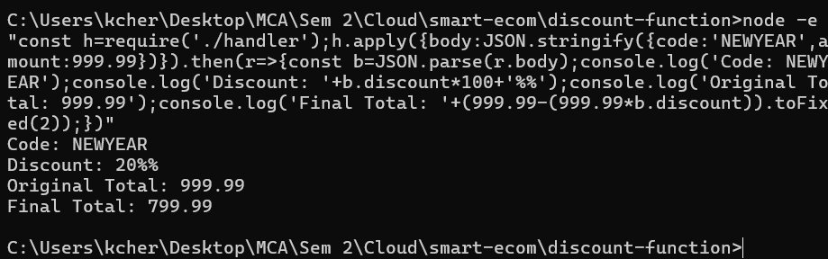

| Code | Discount |
|------|----------|
| NEWYEAR | 20% off |
| Any other | 0% off |

---

## RabbitMQ Messaging

**Terminal 1 — Listen for events:**
```bash
cd inventory-service
python consumer.py
```

**Terminal 2 — Publish payment event:**
```bash
cd payment-service
python notify.py
```

**Terminal 1 receives:**
```
Waiting for events...
Event: payment_processed
```

> Screenshot: Two terminals showing event published and received

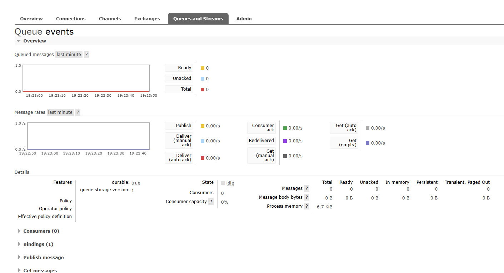

---

### RabbitMQ Management UI

```
URL:      http://localhost:15672
Username: guest
Password: guest
```

> Screenshot: RabbitMQ Management UI showing events queue

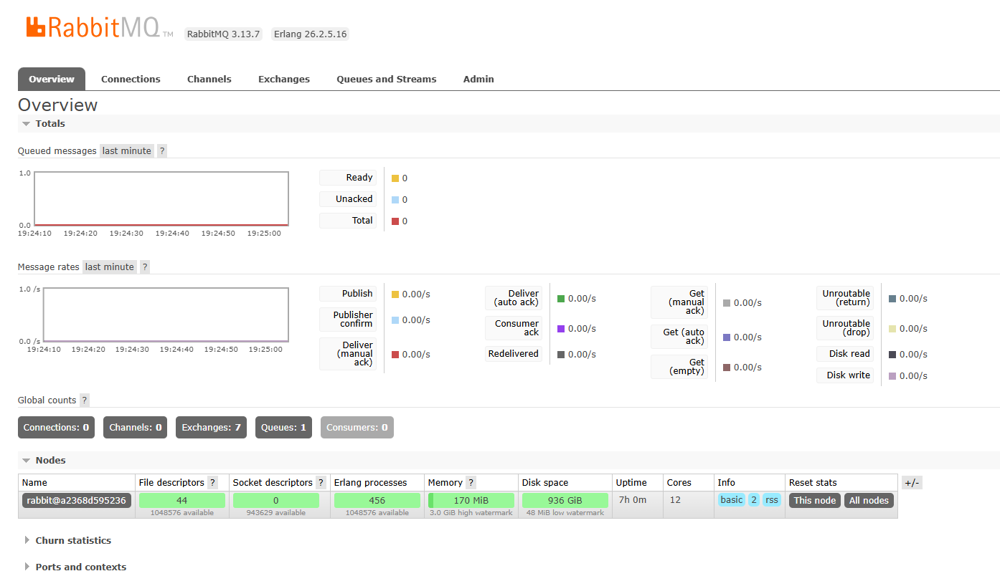

---

## Database Verification

```bash
docker exec -it deploy-mysql-1 mysql -u root -psecret inventory
```

```sql
SELECT * FROM stock;
```

```
+----+------------+-----+
| id | name       | qty |
+----+------------+-----+
|  1 | Laptop     |  50 |
|  2 | Phone      | 100 |
|  3 | Headphones |  30 |
|  4 | Laptop     |  48 |
+----+------------+-----+
```

> Screenshot: MySQL showing persisted inventory data

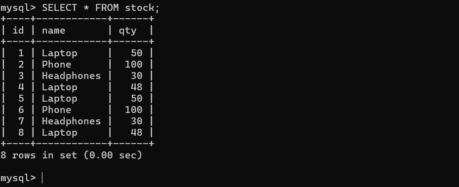

---

## Expected Outcomes

### 1. Checkout Choreography via Postman
```
Cart → Discount → Payment → Inventory
```

### 2. System Resilience
- Inventory updates **persist in MySQL** even after container restart
- RabbitMQ `events` queue confirms **asynchronous communication**

### 3. Real-World Workflow
- Mimics **Amazon/Flipkart** checkout pipeline
- Cart, Payment, and Inventory are **independent but coordinated** services
- Demonstrates **synchronous REST** and **asynchronous messaging**

---

## Shutdown

```bash
cd deploy
docker-compose down
```

---

## Author

**Course:** MCA Semester 2 — Advanced Cloud Computing
**Project:** Smart E-Commerce Checkout System
**Description:** Microservices-based checkout pipeline using Docker, RabbitMQ, MySQL, Node.js, Python, and Spring Boot
